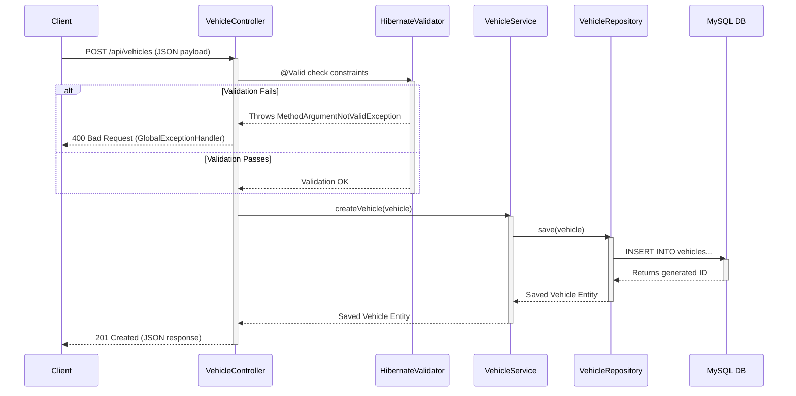

# 📐 Architecture Documentation

FleetOps follows a highly robust, scalable **Layered Architecture** typical of enterprise Spring Boot applications. This architectural pattern ensures a clear separation of concerns, making the system easy to maintain, test, and scale.

## 🏢 Layered Architecture Overview

The system is logically divided into four main layers:

1. **Controller Layer (Presentation Layer)**: Intercepts incoming HTTP REST requests, delegates business processing to the service layer, and returns standardized HTTP responses (JSON).
2. **Service Layer (Business Layer)**: Contains the core business logic. It applies rules (like calculating fuel costs or validating dates) and acts as a bridge between controllers and repositories.
3. **Repository Layer (Persistence Layer)**: Abstracts the database interactions using Spring Data JPA. It translates Java method calls into complex SQL/JPQL queries.
4. **Entity Layer (Domain Model)**: Plain Old Java Objects (POJOs) mapped directly to MySQL database tables using Hibernate ORM.

### Architecture Diagram

```mermaid
graph TD
    Client[Client (Frontend / Postman / Swagger)] -->|HTTP Request| C[Controller Layer]
    
    subgraph Spring Boot Application
        C -->|Validates & Routes| S[Service Layer]
        S -->|Business Logic| R[Repository Layer]
        R -->|Spring Data JPA| E[Entity Layer]
    end
    
    E -->|Hibernate / JDBC| DB[(MySQL Database)]
    DB -->|Result Set| E
    E -->|Mapped Entity| R
    R -->|Entity / Page| S
    S -->|Entity / Page| C
    C -->|HTTP Response (JSON)| Client
```

---

## 🔁 Request & Response Flow

Here is the exact lifecycle of a request entering the FleetOps backend (e.g., Creating a new Vehicle):



---

## 🧩 Core Components Explained

### 1. Controllers (`@RestController`)
Controllers map endpoints using `@RequestMapping`. They utilize Swagger annotations (`@Operation`, `@Tag`) for OpenAPI documentation. Dependency injection is achieved via constructor injection (best practice).

### 2. Services (`@Service`)
We utilize the interface-driven design pattern (`VehicleService` interface and `VehicleServiceImpl` implementation). This allows for easier mocking during unit testing and strict adherence to the Open-Closed Principle (SOLID). 

### 3. Repositories (`@Repository`)
By extending `JpaRepository<T, ID>`, Spring Data JPA automatically provides CRUD operations. We also define custom JPQL queries in repositories like `searchAndFilterVehicles()` to handle advanced searching and pagination logic natively in the database.

### 4. Dependency Injection & Bean Lifecycle
FleetOps utilizes Spring's Inversion of Control (IoC) container. 
- Beans are primarily instantiated as **Singletons**.
- **Constructor Injection** is strictly used over `@Autowired` field injection to ensure immutability and ease of testing.

---

## 🛡️ Cross-Cutting Concerns

### Validation (`jakarta.validation`)
FleetOps does not trust client input. Entities are heavily annotated:
- `@NotBlank`, `@NotNull`
- `@Size(min, max)`
- `@Min`, `@Max`
- `@PastOrPresent`

Validation happens at the Controller boundary via the `@Valid` annotation.

### Global Exception Handling (`@RestControllerAdvice`)
A robust `GlobalExceptionHandler` intercepts all runtime exceptions and translates them into meaningful HTTP responses:
- **`MethodArgumentNotValidException`** ➔ `400 Bad Request` (Field validation errors).
- **`ResourceNotFoundException`** ➔ `404 Not Found` (Entity ID not found).
- **`DataIntegrityViolationException`** ➔ `409 Conflict` (Duplicate unique keys, foreign key violations).
- **`IllegalArgumentException` / `HttpMessageNotReadableException`** ➔ `400 Bad Request`.
- **`Exception`** ➔ `500 Internal Server Error` (Catch-all for unhandled issues).
