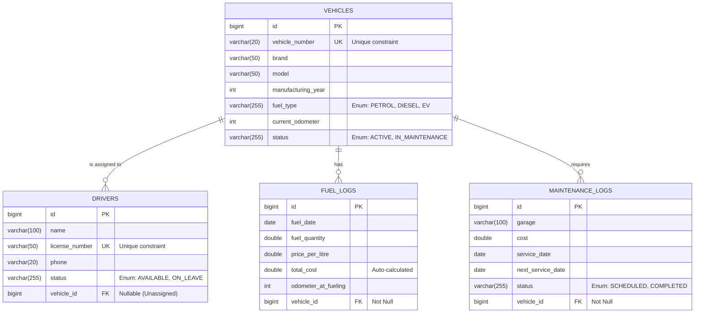

# 🗄️ Database Documentation

FleetOps utilizes a highly normalized, relational database architecture running on **MySQL 8**. The schema is managed automatically by Hibernate (`spring.jpa.hibernate.ddl-auto=update`) based on the JPA `@Entity` definitions.

## Entity-Relationship (ER) Diagram

The central entity is the `Vehicle`. The other modules (Drivers, Fuel Logs, Maintenance) establish foreign-key relationships referencing the vehicle.

---

## 🗃️ Tables Deep Dive

### 1. `vehicles`
The core entity tracking the physical assets of the fleet.
- **Primary Key**: `id` (Auto-increment)
- **Constraints**: 
  - `vehicle_number` must be UNIQUE.
  - Odometer cannot be negative (`@Min(0)`).
- **Relationships**: Parent table for Drivers, Fuel Logs, and Maintenance.

### 2. `drivers`
Tracks the human operators of the vehicles.
- **Primary Key**: `id`
- **Constraints**: `license_number` must be UNIQUE.
- **Foreign Keys**: `vehicle_id` references `vehicles(id)`. This is an optional relationship (a driver can exist without an assigned vehicle).

### 3. `fuel_logs`
An audit trail of all fueling expenses.
- **Primary Key**: `id`
- **Constraints**: `fuel_date` cannot be in the future (`@PastOrPresent`). `fuel_quantity` and `price_per_litre` must be positive.
- **Foreign Keys**: `vehicle_id` references `vehicles(id)`. This is a strictly required relationship (`nullable = false`).

### 4. `maintenance_logs`
Tracks the service history and preventive maintenance scheduling for vehicles.
- **Primary Key**: `id`
- **Constraints**: `next_service_date` must logically occur *after* the `service_date` (enforced via Business Logic in `MaintenanceServiceImpl`).
- **Foreign Keys**: `vehicle_id` references `vehicles(id)`. Required relationship.

---

## 🏗️ Normalization & Database Best Practices

1. **Third Normal Form (3NF)**: The database is normalized to 3NF. There are no repeating groups, and all non-key attributes are fully functionally dependent on the primary key.
2. **Foreign Key Integrity**: The `@ManyToOne` relationships guarantee referential integrity. Attempting to delete a `Vehicle` that is linked to a `FuelLog` will correctly trigger a database constraint violation, which the application gracefully maps to a `409 Conflict`.
3. **Enum Mapping**: Business status indicators (e.g., `VehicleStatus.ACTIVE`, `FuelType.DIESEL`) are stored as strings (`@Enumerated(EnumType.STRING)`) ensuring the database remains highly readable for analytics and debugging compared to ordinal integers.
