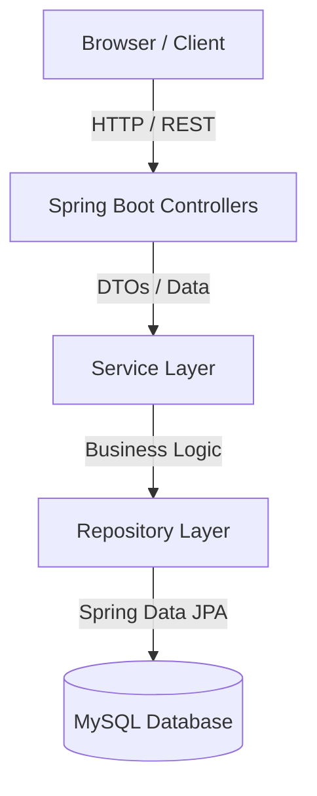

# FleetOps – Fleet Management System

## Project Overview
FleetOps is a comprehensive, full-stack Fleet Management System designed to streamline the administration of vehicles, drivers, fuel logs, and maintenance records. Built with a robust Spring Boot backend and a responsive, dynamic frontend, FleetOps provides organizations with a centralized dashboard to track their entire transportation ecosystem efficiently and securely.

## Features
- **Vehicle Management:** Track vehicle lifecycle, specifications, odometer readings, and current operational status.
- **Driver Management:** Manage driver profiles, licenses, and assignments.
- **Trip Management:** Organize and track individual trips, distance traveled, and associated costs.
- **Fuel Management:** Log refueling events, track fuel consumption trends, and calculate total fuel expenditure.
- **Maintenance Management:** Schedule and record vehicle services, track garage details, and monitor maintenance costs.
- **Dashboard:** A real-time, interactive dashboard providing high-level KPIs and analytics.
- **Authentication:** Secure login and session management powered by Spring Security.
- **REST APIs:** Fully functional, structured RESTful backend for seamless frontend integration.
- **Swagger Documentation:** Automated, interactive API documentation using OpenAPI 3.
- **MySQL Integration:** Reliable and scalable relational data storage using Hibernate and Spring Data JPA.

## Technology Stack
- **Backend:** Java 21, Spring Boot 3.3.x, Spring Security, Spring Data JPA, Hibernate
- **Database:** MySQL 8.x
- **Frontend:** Vanilla JavaScript, HTML5, CSS3, Chart.js (for analytics)
- **Build Tool:** Maven

## System Architecture
The application follows a standard layered architecture to ensure separation of concerns and maintainability:



## Database
**Database Name:** `fleetops_new`

**Major Entities:**
- `vehicles`: Stores vehicle specifications, odometer readings, and status.
- `drivers`: Stores driver credentials, licenses, and availability.
- `fuel_logs`: Links refueling costs and volumes to specific vehicles.
- `maintenance_logs`: Tracks service history, costs, and statuses for vehicles.

*Note: Entities are linked via standard relational mappings (e.g., One-to-Many between Vehicles and Fuel Logs) to maintain referential integrity.*

## API Documentation
The backend exposes a fully interactive API documentation portal using Swagger UI. 
Once the application is running, you can access it at:
`http://localhost:9090/swagger-ui.html`

## Installation Steps
1. **Clone the repository:**
   ```bash
   git clone https://github.com/yourusername/FleetOps.git
   cd FleetOps
   ```
2. **Configure MySQL:**
   Create the database in your local MySQL instance:
   ```sql
   CREATE DATABASE fleetops_new;
   ```
3. **Configure Application:**
   Ensure `src/main/resources/application.properties` contains your correct MySQL credentials (username/password).
4. **Run Spring Boot:**
   ```bash
   mvn clean spring-boot:run
   ```
5. **Open Browser:**
   Navigate to `http://localhost:9090`
6. **Login:**
   Use the default administrator credentials to access the dashboard.

## Screenshots
*(Add high-quality screenshots of the application here before publishing)*

- **Dashboard:** ``
- **Vehicles:** ``
- **Drivers:** ``
- **Trips:** ``
- **Maintenance:** ``
- **Fuel Logs:** ``
- **Swagger UI:** ``

## Future Improvements
- **Analytics & Reports:** Generate downloadable PDF/CSV reports for monthly expenditure.
- **Notifications:** Email or SMS alerts for upcoming vehicle maintenance.
- **Role-based Access:** Differentiate between Admins, Managers, and Drivers with specific permissions.
- **Export Features:** Export grid data directly to Excel.
