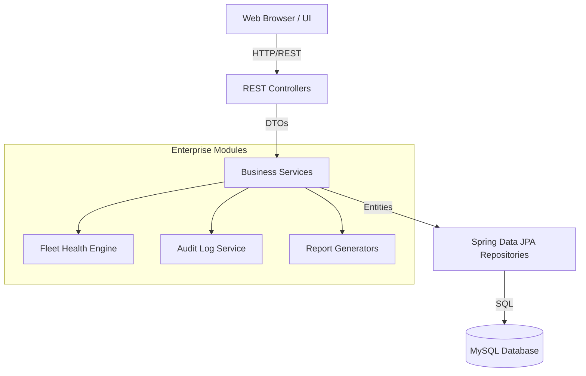
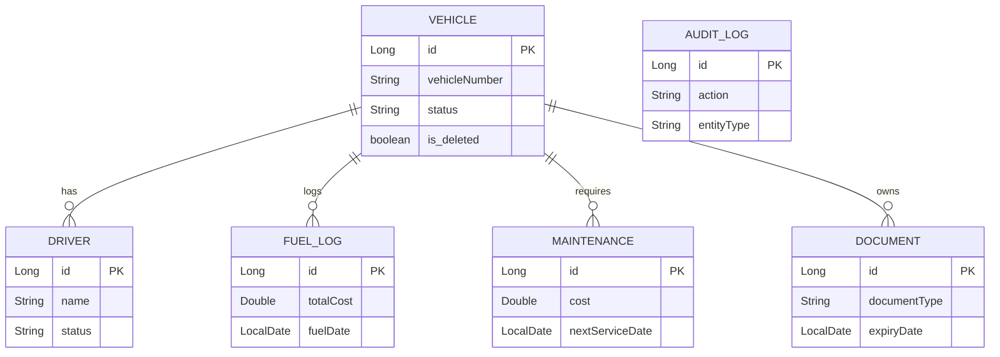

# FleetOps Enterprise

FleetOps Enterprise is a robust, enterprise-grade Fleet Management System built with Spring Boot and Java 21. It provides a comprehensive solution for managing vehicles, drivers, fuel consumption, maintenance schedules, vehicle documents, and reporting. 

## Business Problem
Fleet management operations are often fragmented across disparate spreadsheets, outdated legacy systems, and isolated tracking tools. This fragmentation leads to compliance risks (expired documents), uncontrolled operational costs (fuel inefficiencies, neglected maintenance), and a lack of holistic visibility into fleet health.

## Solution Overview
FleetOps Enterprise unifies all aspects of fleet operations into a single, scalable web application. By employing a clean, layered architecture, it delivers an **Intelligent Fleet Health Engine**, proactive **Maintenance & Document Reminders**, robust **Analytics**, and an **Enterprise Export Center** to ensure 100% operational transparency and compliance.

## Core Features
1. **Intelligent Dashboard**: Real-time Fleet Health score (0-100), active risk detection, and dynamic recommendations.
2. **Vehicle & Driver Roster**: Complete lifecycle management of fleet assets and personnel.
3. **Fuel Analytics & Cost Intelligence**: Tracks fuel expenses, calculates fleet-wide efficiencies, and identifies high-consumption outliers.
4. **Maintenance & Reminders**: Tracks service logs and dynamically generates reminders for upcoming/overdue maintenance and expiring documents.
5. **Document Vault**: Centralized storage for vehicle documents (Insurance, RC, PUC) with automated expiry tracking.
6. **Enterprise Export Center**: Generates on-demand PDF, Excel, and CSV reports.
7. **Compliance & Security**: Soft-delete architecture, exhaustive Audit Logging, and Role-Based Access Control (RBAC).

## Architecture
FleetOps follows a strict **Layered Architecture** leveraging the **Strategy Pattern** (for reporting), **DTO encapsulation**, and **Repository aggregations**.



## Database Schema (ER Diagram)


## Application Screenshots
*(Screenshots to be added here)*
- **Login**
- **Dashboard & Fleet Health**
- **Fuel Analytics**
- **Reports Export Center**
- **Enterprise Audit Logs**

## Technology Stack
- **Backend**: Java 21, Spring Boot 3.3.2, Spring Security, Spring Data JPA
- **Database**: MySQL 8.x
- **Frontend**: HTML5, Vanilla JS, CSS3, Chart.js
- **Exporting**: Apache POI (Excel), OpenPDF (PDF)
- **API Documentation**: Swagger (OpenAPI 3)

## API Documentation
FleetOps provides a fully documented RESTful API. 
To view detailed endpoints, schemas, and test the API directly, navigate to the Swagger UI:
`http://localhost:9091/swagger-ui/index.html`

### High-Level API Structure
- `/api/vehicles/**`: Vehicle CRUD & Status updates
- `/api/drivers/**`: Driver CRUD
- `/api/fuel/**`: Fuel Logs & Analytics Aggregations
- `/api/maintenance/**`: Maintenance Logs
- `/api/documents/**`: Document uploads & lifecycle
- `/api/reminders/**`: Dynamic Intelligence Reminders
- `/api/reports/export`: PDF/Excel/CSV Generation
- `/api/audit-logs`: Read-only system audit trails

## Installation Guide

### Prerequisites
- Java JDK 21+
- Maven 3.8+
- MySQL 8.0+

### Database Setup
1. Open MySQL and create the database:
   ```sql
   CREATE DATABASE fleetops_new;
   ```
2. The application relies on `application.properties` to connect.

### Configuration
Set the following Environment Variables in your IDE or OS before running:
- `MYSQL_HOST` (default: localhost)
- `MYSQL_PORT` (default: 3306)
- `MYSQL_USER` (default: root)
- `MYSQL_PASSWORD` (default: password)
- `ADMIN_PASSWORD` (default: password)

### Running the Application
```bash
mvn clean install
mvn spring-boot:run
```

**Default Credentials:**
- **URL**: `http://localhost:9091/login`
- **Username**: `admin`
- **Password**: `password` (or whatever `ADMIN_PASSWORD` is set to)

## Future Enhancements
- **Mobile Application**: REST API is fully decoupled to support a Flutter/React Native driver app.
- **Microservices**: Extracting Reporting and Fleet Health into separate services for massive scale.
- **Cloud Storage**: Migrating local file uploads to AWS S3.

## License
This project is open-source and available under the MIT License.
